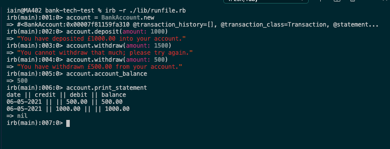

# Bank Tech Test

| [](https://github.com/rubocop/rubocop) | [](https://rubystyle.guide) | [](https://codeclimate.com/github/iainaitken/bank-tech-test/maintainability) |

## Tech Stack

Ruby version 2.7.2

Gems:

* Coveralls
* RSpec
* Rubocop
* SimpleCov

## Directions

### Installation

To grab the repo from github, enter the following command in your terminal window in the folder where you would like the project folder to be located:

```bash
% git clone https://github.com/iainaitken/bank-tech-test.git
```

Navigate to the project folder:

```bash
% cd bank-tech-test
```

Install dependencies:

```bash
% bundle install
```

### Testing

To run the test suite, enter the following command in the project folder:

```bash
% rspec
```

Test coverage is currently 96.52%.

### Usage

To use the program, first open the runfile in IRB:

```bash
% ruby -r ./lib/runfile.rb
```

In IRB, you first create a new account:

```ruby
account = BankAccount.new
```

You can add transactions to the account by specifying the date, type of transaction and the amount:

```ruby
account.add_transaction(date: '06/04/2021', type: 'credit', amount: 1000)
```

Note:

* Keyword arguments are used.
* Amounts must be in the form of an integer and must be whole pounds only.
* Dates must be in the form of a string and in the format 'DD/MM/YYYY'.
* Transaction type must be in the form of a string and can be either "debit" or "credit".

To print out a statement:

```ruby
account.print_statement
```

## Screenshot



## Specifications

### Requirements

* You should be able to interact with your code via a REPL like IRB or the JavaScript console. (You don't need to implement a command line interface that takes input from STDIN.)
* Deposits, withdrawal.
* Account statement (date, amount, balance) printing.
* Data can be kept in memory (it doesn't need to be stored to a database or anything).

### Acceptance Criteria

Given a client makes a deposit of 1000 on 10-01-2012

And a deposit of 2000 on 13-01-2012

And a withdrawal of 500 on 14-01-2012

When she prints her bank statement she would see

> date || credit || debit || balance
> 
> 14/01/2012 || || 500.00 || 2500.00
> 
> 13/01/2012 || 2000.00 || || 3000.00
> 
> 10/01/2012 || 1000.00 || || 1000.00

## Design Notes

I decided to implement the following classes in this program:

* Transaction. This class would hold the details of an individual transaction and the resulting balance in the account. 
* BankAccount. This class would have two main responsibilities; first, it would hold all of the Transaction instances as a transaction history. It would also contain a method to let the user add a transaction to the transaction history. It also keeps track of the account balance, so that data can be easily accessed elsewhere in the program.
* TransactionValidator. This class functions as an error checker; it takes the information submitted by the user and checks that it is valid, in particular that:
  * The transaction does not result in the account becoming overdrawn.
  * The transaction type is valid, i.e. it is either "debit" or "credit".
  * The amount of the transaction is an integer.
* Statement. This class allows the user to view their transaction history.

Although BankAccount has two main responsibilities, I decided against splitting any more of it out to a different class, to avoid the program becoming too fragmented and difficult to follow. The responsibilities of that class (tracking transactions and account balance) are closely related and it didn't make sense to me to have, for example, a separate TransactionHistory class which would add a layer of complexity that isn't justified.

I decided on using an integer datatype for the amounts based on the specifications, which state that an entry of (for example) 1000 would be £1,000, and represented in the statement as 1000.00. Otherwise, I would have used integers to represent pence, to avoid difficulties in using floats to represent money - this would have meant that the input would need to be 100000 to represent £1,000. This can be easily amended if necessary to allow the user to enter both pounds and pence.

I decided that the date should be entered by the user as an argument rather than generated by the program automatically. This is because the data in the program does not persist, and would be manually entered by the user when they wanted to print out a statement.

The program was build using a TDD approach.

### CRC Cards

#### BankAccount

| Responsibility | Collaborator |
| ----------- | --- |
| Knows balance |   |
| Knows transaction history | Transaction  |
| Add_transaction | Transaction |

#### Transaction

| Responsibility | Collaborator |
| ----------- | --- |
| Knows date |   |
| Knows type |   |
| Knows amount |  |
| Knows resulting account balance |   |

#### TransactionValidator

| Responsibility | Collaborator |
| ----------- | --- |
| Checks validity of user input | BankAccount  |

#### Statement

| Responsibility | Collaborator |
| ----------- | --- |
| Prints out a statement | BankAccount  |
